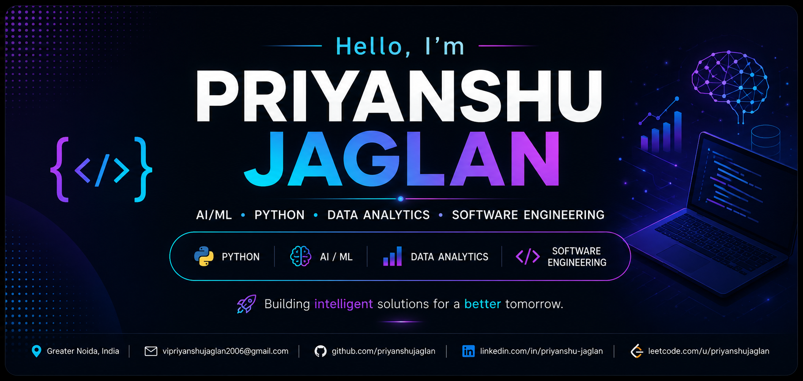

  

 
# 👋 Hi, I'm Priyanshu Jaglan

### AI/ML • Python • Data Analytics • Software Engineering

I'm a Computer Science (AI) student passionate about building practical AI-driven applications and solving real-world problems with software.

🎓 B.Tech CSE (AI) @ Galgotia's College of Engineering and Technology  
🤖 Interested in Artificial Intelligence & Machine Learning  
🐍 Python Developer  
📊 Data Analytics & Data Visualization  
💻 Software Engineering & Backend Development  

---

## 🧑‍💻 About Me

- 🎓 Pursuing B.Tech in Computer Science (AI), 2023–2027
- 💡 Strong foundation in Data Structures & Algorithms, OOP, DBMS and OS
- 🤖 Building Machine Learning and AI-powered applications
- 🐍 Experienced with Python and its data/ML ecosystem
- 🌐 Interested in REST APIs and application development
- 🧠 Solved 100+ DSA problems
- 🏆 4th position at National Level Hackathon NexHack 2025

---

## 🛠️ Tech Stack

### 👨‍💻 Languages

### 🤖 AI / Machine Learning

### 🌐 Web & APIs

### 🗄️ Database & Tools

---

## 🚀 Featured Projects

### 💳 Credit Card Fraud Detection System

Machine Learning system for detecting fraudulent transactions.

- Dataset of 280,000+ transactions
- Logistic Regression & Random Forest
- SMOTE-based class imbalance handling
- Achieved **94% recall** for fraudulent transactions

---

### 🎬 Movie Recommendation System

Content-based movie recommendation system built with Python.

- Dataset of 5,000+ movies
- CountVectorizer & Cosine Similarity
- Real-time top-5 recommendations
- Interactive Streamlit interface
- Tested with 50+ users and 300+ recommendation requests

---

### 🤖 AI Resume Analyzer

AI-powered resume analysis platform currently in development.

- PDF resume information extraction
- NLP-based semantic matching
- Job description matching
- Skill-gap identification
- ATS-style feedback
- ReactJS frontend + FastAPI backend
- Candidate scoring and visualization

---

### 🎙️ Virtual Assistant

Voice-controlled Python assistant integrating REST APIs.

- Speech recognition
- Text-to-speech
- Real-time news and content fetching
- YouTube search using yt-dlp
- Web automation

---

## 🏆 Achievements

🏅 **4th Position — National Level Hackathon NexHack 2025**  
Led my team to secure 4th position among **108 teams**.

💻 **100+ Data Structures & Algorithms Problems Solved**

👨‍💻 **Secretary — CodeForge Society 2025–26**

---

## 📜 Certifications

- **Data Analytics Job Simulation** — Deloitte (Forage)
- **AWS AI Practitioner (AIF-C01)** — AWS Training & Certification

---

## 🎓 Education

**B.Tech — Computer Science (Artificial Intelligence)**  
Galgotia's College of Engineering and Technology  
2023–2027 | **CGPA: 7.5/10**

---

## 💻 Coding & Development

- 💻 100+ DSA problems solved
- 🤖 Machine Learning projects
- 📊 Data Analytics & Visualization
- 🌐 REST API development
- 🚀 Interactive applications with Streamlit

---

## 📊 GitHub Stats

  
  

---

## 🔥 GitHub Contribution Streak

  

---

## 🤝 Connect With Me

📧 **Email:** vipriyanshujaglan2006@gmail.com

---

### 💡 Always learning. Always building. Always improving.

⭐ Feel free to explore my repositories and connect with me!
